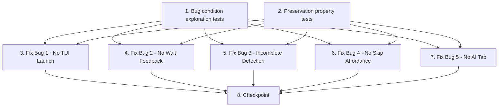

# Implementation Plan

> **Status: superseded** by `mvp-review-pipeline`.
> 
> The boxes below are ticked because this work did land, but the onboarding
> questionnaire it describes was then removed: `lgtm init` now asks nothing. Kept
> as the record of why that reversal happened.

## Overview

This implementation plan addresses five defects in the LGTM CLI's `init` onboarding flow using the exploratory bugfix methodology. The fixes cover:

1. **No TUI Launch After Init** — `lgtm init` completes onboarding but never launches the TUI
2. **No Feedback During Autodiscovery Wait** — users see no progress indication while AI providers are detected
3. **Incomplete AI Agent Detection** — Codex CLI and Claude Code are not properly registered as providers
4. **No Skip Affordance** — no option to skip interactive setup and use defaults
5. **No AI Management Screen in TUI** — no tab for managing AI provider configuration post-setup

The workflow follows the bug condition methodology: write exploration tests first (expect failure), write preservation tests (expect pass), implement fixes, then verify all tests pass.

## Tasks

- [x] 1. Write bug condition exploration tests
  - **Property 1: Bug Condition** - Init Onboarding Five Defects
  - **IMPORTANT**: Write these property-based tests BEFORE implementing the fixes
  - **CRITICAL**: These tests MUST FAIL on unfixed code — failure confirms the bugs exist
  - **DO NOT attempt to fix the tests or the code when they fail**
  - **NOTE**: These tests encode the expected behavior — they will validate the fixes when they pass after implementation
  - **GOAL**: Surface counterexamples that demonstrate all five bugs exist in the current codebase
  - **Scoped PBT Approach**: Each test targets a specific bug condition with concrete failing inputs
  - Test file: `packages/core/src/__tests__/bug-conditions.test.ts`
  - **Bug 1 — No TUI Launch After Init**:
    - Import and call the `init` command action handler from `packages/core/src/index.ts`
    - Mock `launchTUI()` from `packages/core/src/tui/render.ts`
    - Verify that after `runOnboarding()` resolves successfully, `launchTUI()` is called (will FAIL — confirming bug)
    - Bug condition: `isBugCondition_NoTUILaunch(X) = X.command = "init" AND X.onboardingCompleted = true`
    - Expected behavior: `result.tuiLaunched = true`
  - **Bug 2 — No Feedback During Autodiscovery Wait**:
    - Mock `discoverAIProviders()` in `packages/core/src/onboarding/detect-ai.ts` to take 3000ms
    - Run `runOnboarding()` from `packages/core/src/onboarding/flow.ts` programmatically with stdin mock
    - Capture stdout output between reaching `aiProvider` question and discovery completion
    - Assert stdout contains spinner or "Detecting AI providers..." text (will FAIL — confirming bug)
    - Bug condition: `isBugCondition_NoWaitFeedback(X) = X.currentQuestion = "aiProvider" AND X.aiDiscoveryComplete = false`
    - Expected behavior: `result.displayedWaitIndicator = true`
  - **Bug 3 — Incomplete Agent Detection (Codex)**:
    - Set `process.env.CODEX_API_KEY = "sk-test-codex-key"`
    - Call `discoverAIProviders()` from `packages/core/src/onboarding/detect-ai.ts`
    - Assert result.providers contains entry with `detectedVia` containing "Codex" (will FAIL — confirming bug)
    - Bug condition: `isBugCondition_MissingAgent(X) = X.codexCLIInstalled AND X.codexAPIKeySet`
    - Expected behavior: `exists(p IN result.providers WHERE p.detectedVia CONTAINS "Codex")`
  - **Bug 3b — Incomplete Agent Detection (Claude Code)**:
    - Mock `~/.claude/config.json` with `{ claudeApiKey: "sk-ant-xxx" }` (newer path format)
    - Ensure `claude` binary mock is on PATH
    - Call `discoverAIProviders()` from `packages/core/src/onboarding/detect-ai.ts`
    - Assert result.providers contains entry with `detectedVia` containing "Claude Code" (will FAIL — confirming fragile detection)
  - **Bug 4 — No Skip Affordance**:
    - Run `runOnboarding()` from `packages/core/src/onboarding/flow.ts` with stdin mock
    - Capture stdout output at the start of the interactive flow (before first question)
    - Assert output contains "q" or "Skip setup" or "use defaults" option text (will FAIL — confirming bug)
    - Bug condition: `isBugCondition_NoSkipAffordance(X) = X.command = "init" AND X.isInteractive = true AND X.skipAllOptionPresented = false`
    - Expected behavior: `result.skipOptionPresented = true`
  - **Bug 5 — No AI Management Screen in TUI**:
    - Import and render `Shell` from `packages/core/src/tui/Shell.tsx` using Ink testing utilities
    - Query rendered output for an "AI" tab in the tab navigation
    - Assert "AI" tab exists and is navigable (will FAIL — confirming bug)
    - Bug condition: `isBugCondition_NoAIManagement(X) = X.tuiRunning = true AND X.aiTabExists = false`
    - Expected behavior: `result.aiTabAvailable = true`
  - Run tests on UNFIXED code
  - **EXPECTED OUTCOME**: All tests FAIL (this is correct — it proves the bugs exist)
  - Document counterexamples found to understand root causes
  - Mark task complete when tests are written, run, and failures are documented
  - _Requirements: 1.1, 1.2, 1.3, 1.4, 1.5, 1.6, 1.7_

- [x] 2. Write preservation property tests (BEFORE implementing fixes)
  - **Property 2: Preservation** - Existing CLI/TUI/Onboarding Behaviors Unchanged
  - **IMPORTANT**: Follow observation-first methodology
  - **IMPORTANT**: Write these tests BEFORE implementing any fixes
  - Test file: `packages/core/src/__tests__/preservation.test.ts`
  - **Observe behavior on UNFIXED code, then write property-based tests:**
  - **Preservation A — Bare `lgtm` auto-onboarding then TUI**:
    - Observe: bare `lgtm` (no args) with incomplete profile runs onboarding then launches TUI
    - Write property: for all CLI invocations where command is empty and profile incomplete, onboarding runs followed by TUI launch
    - Reference: `packages/core/src/index.ts` bare-command path (lines 48-100)
  - **Preservation B — `--skip-onboarding` skips without TUI**:
    - Observe: `lgtm init --skip-onboarding` applies defaults, does NOT launch TUI
    - Write property: for all invocations with `--skip-onboarding` flag set, no TUI launch occurs and defaults are applied
    - Reference: `packages/core/src/index.ts` init command handler
  - **Preservation C — `config --edit` runs onboarding without TUI**:
    - Observe: `lgtm config --edit` re-runs onboarding questions, does NOT launch TUI afterward
    - Write property: for all `config --edit` invocations, onboarding re-runs but TUI does not launch
    - Reference: config command handler in `packages/core/src/index.ts`
  - **Preservation D — Ctrl+C exits cleanly**:
    - Observe: Ctrl+C during onboarding exits gracefully, no TUI launch, no partial state corruption
    - Write property: for all onboarding sessions interrupted by SIGINT, process exits cleanly without launching TUI
    - Reference: signal handling in `packages/core/src/onboarding/flow.ts`
  - **Preservation E — Single provider auto-configure**:
    - Observe: when exactly one AI provider is auto-detected, it is auto-configured and AI question is skipped
    - Write property: for all discovery results with exactly 1 provider, AI question is skipped and provider is auto-configured
    - Reference: `packages/core/src/onboarding/flow.ts` AI question handling
  - **Preservation F — Individual question skip with 's'**:
    - Observe: pressing 's' on any individual question skips just that question
    - Write property: for all questions in the flow, 's' input skips only the current question
    - Reference: `packages/core/src/onboarding/flow.ts` question loop
  - **Preservation G — Plugin tabs in TUI unchanged**:
    - Observe: TUI Shell renders existing plugin tabs (review, specify, learn) correctly
    - Write property: for all TUI sessions, existing plugin tabs are present and navigable
    - Reference: `packages/core/src/tui/Shell.tsx` tab rendering
  - Run all preservation tests on UNFIXED code
  - **EXPECTED OUTCOME**: All tests PASS (this confirms baseline behavior to preserve)
  - Mark task complete when tests are written, run, and passing on unfixed code
  - _Requirements: 3.1, 3.2, 3.3, 3.4, 3.5, 3.6, 3.7, 3.8, 3.9, 3.10_

- [x] 3. Fix for No TUI Launch After Init (Bug 1)

  - [x] 3.1 Extract shared TUI launch helper
    - Create `buildAndLaunchTUI(ctx, plugins)` helper in `packages/core/src/tui/render.ts`
    - Refactor existing TUI launch code from `packages/core/src/index.ts` (lines 48-100) to use the helper
    - Helper should accept context (config, profile, aiStatus) and plugins array
    - Helper should handle tab initialization, Ink app creation, and rendering
    - _Bug_Condition: isBugCondition_NoTUILaunch(X) = X.command = "init" AND X.onboardingCompleted = true_
    - _Expected_Behavior: After init completes, TUI launches with same initialization as bare `lgtm` path_
    - _Preservation: Bare `lgtm` must continue to work identically using the same helper_
    - _Requirements: 2.1, 3.1_

  - [x] 3.2 Wire TUI launch into `init` command handler
    - In `packages/core/src/index.ts`, after `runOnboarding()` resolves in the `init` action handler (line ~168)
    - Call `buildAndLaunchTUI()` with the same tab/plugin/aiStatus initialization
    - Do NOT launch TUI if `--skip-onboarding` is set (preserves requirement 3.2)
    - Add `options.source` parameter to distinguish `init` from `config --edit` — only launch TUI from `init`
    - _Bug_Condition: isBugCondition_NoTUILaunch(X) = X.command = "init" AND X.onboardingCompleted = true_
    - _Expected_Behavior: result.tuiLaunched = true_
    - _Preservation: --skip-onboarding does NOT launch TUI; config --edit does NOT launch TUI_
    - _Requirements: 2.1, 3.2, 3.6_

  - [x] 3.3 Verify bug condition exploration test for Bug 1 now passes
    - **Property 1: Expected Behavior** - TUI Launch After Init
    - **IMPORTANT**: Re-run the SAME Bug 1 test from task 1 — do NOT write a new test
    - The test from task 1 encodes: after `init` completes, `launchTUI()` is called
    - When this test passes, it confirms the expected behavior is satisfied
    - **EXPECTED OUTCOME**: Test PASSES (confirms bug is fixed)
    - _Requirements: 2.1_

  - [x] 3.4 Verify preservation tests still pass for Bug 1
    - **Property 2: Preservation** - Bare lgtm, --skip-onboarding, config --edit
    - **IMPORTANT**: Re-run preservation tests A, B, C from task 2 — do NOT write new tests
    - Confirm bare `lgtm` still chains onboarding → TUI
    - Confirm `--skip-onboarding` still does not launch TUI
    - Confirm `config --edit` still does not launch TUI
    - **EXPECTED OUTCOME**: Tests PASS (confirms no regressions)
    - _Requirements: 3.1, 3.2, 3.6_

- [x] 4. Fix for No Feedback During Autodiscovery Wait (Bug 2)

  - [x] 4.1 Add spinner/wait indicator before AI discovery await
    - In `packages/core/src/onboarding/flow.ts`, locate the `aiProvider` question handling block
    - Before `const discovery = await aiDiscoveryPromise`, use `Promise.race` with a 500ms timer
    - If timer fires first (discovery still pending), write "⏳ Detecting AI providers..." to stdout
    - Use `process.stdout.write` with `\r` overwrite for spinner animation compatible with readline
    - Clear spinner line once discovery resolves (overwrite with spaces then `\r`)
    - _Bug_Condition: isBugCondition_NoWaitFeedback(X) = X.currentQuestion = "aiProvider" AND X.aiDiscoveryComplete = false_
    - _Expected_Behavior: result.displayedWaitIndicator = true AND result.awaitedDiscovery = true_
    - _Preservation: If discovery completes in <500ms, no spinner is shown (fast-path unchanged)_
    - _Requirements: 2.2, 3.4_

  - [x] 4.2 Verify bug condition exploration test for Bug 2 now passes
    - **Property 1: Expected Behavior** - Autodiscovery Wait Feedback
    - **IMPORTANT**: Re-run the SAME Bug 2 test from task 1 — do NOT write a new test
    - The test from task 1 encodes: stdout contains spinner/detecting text when discovery is slow
    - When this test passes, it confirms feedback is displayed during wait
    - **EXPECTED OUTCOME**: Test PASSES (confirms bug is fixed)
    - _Requirements: 2.2_

  - [x] 4.3 Verify preservation tests still pass for Bug 2
    - **Property 2: Preservation** - Single provider auto-configure, individual skip
    - **IMPORTANT**: Re-run preservation tests D, E, F from task 2 — do NOT write new tests
    - Confirm Ctrl+C still exits cleanly
    - Confirm single provider auto-configure still works
    - Confirm individual question skip still works
    - **EXPECTED OUTCOME**: Tests PASS (confirms no regressions)
    - _Requirements: 3.4, 3.5_

- [x] 5. Fix for Incomplete AI Agent Detection (Bug 3)

  - [x] 5.1 Register Codex as proper provider in `checkEnvVars()`
    - In `packages/core/src/onboarding/detect-ai.ts`, locate `checkEnvVars()` function
    - When `CODEX_API_KEY` is set (non-empty), push a full `DetectedProvider` to `providers` array:
      - `id: "openai"`, `name: "Codex CLI (OpenAI)"`, `detectedVia: "CODEX_API_KEY env var"`
      - `apiKey: process.env.CODEX_API_KEY`, `defaultModel: "gpt-4o-mini"`
    - Handle deduplication: if both `OPENAI_API_KEY` and `CODEX_API_KEY` are set and equal, only register once (prefer OPENAI_API_KEY entry)
    - If both are set but different, register both (downstream deduplication by `id` will keep the first)
    - _Bug_Condition: isBugCondition_MissingAgent(X) where X.codexAPIKeySet = true_
    - _Expected_Behavior: exists(p IN result.providers WHERE p.detectedVia CONTAINS "Codex")_
    - _Preservation: Existing OPENAI_API_KEY detection unchanged; tools array still includes "Codex CLI"_
    - _Requirements: 2.3, 2.5_

  - [x] 5.2 Implement robust Claude Code credential discovery in `checkClaudeCode()`
    - In `packages/core/src/onboarding/detect-ai.ts`, locate `checkClaudeCode()` function
    - Expand credential file paths to check:
      - `~/.claude/credentials.json` (existing)
      - `~/.claude/.credentials` (existing)
      - `~/.claude/auth.json` (existing)
      - `~/.claude/config.json` (newer versions)
      - `~/.config/claude/credentials.json` (XDG-compliant)
      - `~/.claude/settings.local.json` (alternative storage)
      - `$ANTHROPIC_CONFIG_DIR/credentials.json` (env-based override)
    - Parse multiple JSON structures: `{ apiKey }`, `{ claudeApiKey }`, `{ oauth: { access_token } }`, `{ credentials: { apiKey } }`
    - Fallback: if no credential file found, check if `claude --version` succeeds (binary exists) and attempt session detection
    - Register as `DetectedProvider` with `id: "anthropic"`, `name: "Claude Code"`, `detectedVia: "Claude Code CLI"`
    - _Bug_Condition: isBugCondition_MissingAgent(X) where X.claudeCodeCLIInstalled = true AND X.hasClaudeCredentials = true_
    - _Expected_Behavior: exists(p IN result.providers WHERE p.detectedVia CONTAINS "Claude Code")_
    - _Preservation: Existing three-path detection still works if files exist at those paths_
    - _Requirements: 2.4, 2.5_

  - [x] 5.3 Verify bug condition exploration test for Bug 3 now passes
    - **Property 1: Expected Behavior** - Codex and Claude Code Agent Detection
    - **IMPORTANT**: Re-run the SAME Bug 3 and 3b tests from task 1 — do NOT write new tests
    - The tests from task 1 encode: Codex registered as provider with CODEX_API_KEY; Claude Code detected via expanded paths
    - When these tests pass, it confirms agent detection is complete
    - **EXPECTED OUTCOME**: Tests PASS (confirms bug is fixed)
    - _Requirements: 2.3, 2.4, 2.5_

  - [x] 5.4 Verify preservation tests still pass for Bug 3
    - **Property 2: Preservation** - Single provider auto-configure preserved
    - **IMPORTANT**: Re-run preservation test E from task 2 — do NOT write new tests
    - Confirm single-provider auto-configure still works when only one provider detected
    - Confirm no-provider manual selection still appears when none detected
    - **EXPECTED OUTCOME**: Tests PASS (confirms no regressions)
    - _Requirements: 3.3, 3.4_

- [x] 6. Fix for No Skip Affordance During Init (Bug 4)

  - [x] 6.1 Add skip-all prompt before first onboarding question
    - In `packages/core/src/onboarding/flow.ts`, locate `runOnboarding()` function
    - After printing the welcome message and BEFORE entering the question loop:
    - Present: "Press [q] to skip setup and use defaults, or [Enter] to continue"
    - Only show when `existingProfile` is null (fresh start — don't show when resuming or editing)
    - Listen for 'q' keypress or Enter keypress
    - _Bug_Condition: isBugCondition_NoSkipAffordance(X) = X.command = "init" AND X.isInteractive = true AND X.flowPhase = "pre-questions"_
    - _Expected_Behavior: result.skipOptionPresented = true_
    - _Preservation: If user does NOT press 'q', all questions still presented in existing order with 's' skip support_
    - _Requirements: 2.6, 3.7_

  - [x] 6.2 Implement skip logic with sensible defaults
    - In `packages/core/src/onboarding/flow.ts`, when user presses 'q' at the skip prompt:
    - Apply defaults: `storageMode: "repo"`, `goal: "production"`, `feedbackStyle: "direct"`, `teamSize: "solo"`
    - For AI: run autodiscovery (await `aiDiscoveryPromise`), auto-configure if found, else set provider to "none"
    - Call `saveProgress()` with defaults applied
    - Print brief summary: "Using defaults. Run `lgtm config --edit` to customize."
    - Return the profile (flow ends, caller handles TUI launch)
    - _Bug_Condition: isBugCondition_NoSkipAffordance(X) where X.userWantsToSkipAll = true_
    - _Expected_Behavior: result.defaultsApplied = true AND result.onboardingQuestionsAsked = 0_
    - _Preservation: Later reconfiguration via `config --edit` or TUI AI tab still works_
    - _Requirements: 2.6, 3.8_

  - [x] 6.3 Verify bug condition exploration test for Bug 4 now passes
    - **Property 1: Expected Behavior** - Skip Init Affordance
    - **IMPORTANT**: Re-run the SAME Bug 4 test from task 1 — do NOT write a new test
    - The test from task 1 encodes: stdout contains skip option text before first question
    - When this test passes, it confirms the skip affordance is presented
    - **EXPECTED OUTCOME**: Test PASSES (confirms bug is fixed)
    - _Requirements: 2.6_

  - [x] 6.4 Verify preservation tests still pass for Bug 4
    - **Property 2: Preservation** - Individual question skip, Ctrl+C exit
    - **IMPORTANT**: Re-run preservation tests D, F from task 2 — do NOT write new tests
    - Confirm Ctrl+C at skip prompt exits cleanly
    - Confirm individual question skip with 's' still works after user presses Enter to continue
    - Confirm all questions still presented when user does not press 'q'
    - **EXPECTED OUTCOME**: Tests PASS (confirms no regressions)
    - _Requirements: 3.5, 3.7_

- [x] 7. Fix for No AI Management Screen in TUI (Bug 5)

  - [x] 7.1 Create AITab component
    - Create new file: `packages/core/src/tui/AITab.tsx`
    - Implement Ink component with sections:
      - **Status**: Current provider name, model, connection status (reachable/offline indicator)
      - **Providers**: List of all detected providers with status indicators (✓/✗)
      - **Actions**: Keyboard shortcuts: [r] Re-discover providers, [s] Switch provider, [m] Change model, [t] Test connection
    - Accept props: `config`, `profile`, `onConfigUpdate` callback
    - Use `useInput()` hook from Ink for keyboard shortcut handling
    - Provider re-discovery: invoke `discoverAIProviders()` and update display
    - Provider switching: show selection menu of available providers, update config on selection
    - Model selection: show model suggestions for current provider, accept text input
    - Persist changes: write updates to profile via OKF store using `config/loader.ts` save function
    - _Bug_Condition: isBugCondition_NoAIManagement(X) = X.tuiRunning = true AND X.userAction IN {changeProvider, changeModel, rediscoverProviders, checkStatus}_
    - _Expected_Behavior: result.aiTabAvailable = true AND result.aiTabFunctional = true_
    - _Requirements: 2.7_

  - [x] 7.2 Register AI tab in Shell and index.ts
    - In `packages/core/src/tui/Shell.tsx`:
      - Import AITab component
      - Add "AI" tab to the tab navigation array (after existing plugin tabs)
      - Thread config/profile/store references to AITab via props or context
    - In `packages/core/src/index.ts`:
      - Add AI tab to the `tabs` array when building TUI tabs (in both bare `lgtm` and `init` paths)
      - Pass `aiStatus`, `config`, `profile` to the AI tab
    - Handle "No provider configured" state: show helpful message with prompt to run detection
    - _Bug_Condition: isBugCondition_NoAIManagement(X) where X.aiTabExists = false_
    - _Expected_Behavior: result.aiTabExists = true, navigable via standard tab navigation_
    - _Preservation: Existing plugin tabs (review, specify, learn) unchanged and still navigable_
    - _Requirements: 2.7, 3.9, 3.10_

  - [x] 7.3 Verify bug condition exploration test for Bug 5 now passes
    - **Property 1: Expected Behavior** - AI Management Screen in TUI
    - **IMPORTANT**: Re-run the SAME Bug 5 test from task 1 — do NOT write a new test
    - The test from task 1 encodes: Shell renders an "AI" tab that is navigable
    - When this test passes, it confirms the AI management screen exists
    - **EXPECTED OUTCOME**: Test PASSES (confirms bug is fixed)
    - _Requirements: 2.7_

  - [x] 7.4 Verify preservation tests still pass for Bug 5
    - **Property 2: Preservation** - Plugin tabs unchanged
    - **IMPORTANT**: Re-run preservation test G from task 2 — do NOT write new tests
    - Confirm existing plugin tabs (review, specify, learn) still render correctly
    - Confirm tab navigation still works for all tabs
    - **EXPECTED OUTCOME**: Tests PASS (confirms no regressions)
    - _Requirements: 3.9, 3.10_

- [x] 8. Checkpoint — Ensure all tests pass
  - Run full test suite: `bun test`
  - Ensure ALL bug condition exploration tests from task 1 now PASS (all 5 bugs are fixed)
  - Ensure ALL preservation property tests from task 2 still PASS (no regressions)
  - Verify no TypeScript compilation errors: `bun run typecheck` or `tsc --noEmit`
  - If any test fails, identify which fix caused the regression and address it
  - Ensure all tests pass, ask the user if questions arise

## Task Dependency Graph



```json
{
  "waves": [
    { "tasks": [1, 2] },
    { "tasks": [3, 4, 5, 6, 7] },
    { "tasks": [8] }
  ]
}
```

## Notes

- **Test-first approach**: Tasks 1 and 2 MUST be completed before any implementation tasks (3–7). The exploration tests are expected to fail initially (confirming bugs exist), while preservation tests must pass on unfixed code.
- **Independent fixes**: Bug fixes 3–7 are independent of each other and can be implemented in any order after tasks 1 and 2 are complete. However, they are ordered by complexity for recommended sequencing.
- **Shared TUI helper**: Bug 1 fix (task 3) introduces `buildAndLaunchTUI()` which is reused by Bug 5 fix (task 7) when registering the AI tab. Implement task 3 before task 7 if possible.
- **Test runner**: Use `bun test` for running the test suite. Tests use Bun's built-in test runner with vitest-compatible APIs.
- **No code generation**: This spec produces only test specifications and implementation guidance — actual code files are created during task execution, not during spec creation.
