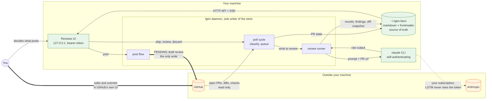

# Data flow and boundaries

Where data lives, which way it moves, and the lines it is not allowed to cross.
[design.md](spec/design.md) has the component view; this is the trust view.

## What the lines mean

**GitHub is read-only until you say otherwise.** Watching, classifying and
reviewing never write. One code path writes, the post flow, and what it creates
is a review only its author can see. No function anywhere sends an `event`
field, so publishing is not a thing the code can do, and a test plants an event
key to prove its scanner would notice one appearing.

**The store is the source of truth, and the daemon is its only writer.** The UI
and the CLI change state by asking the daemon over its HTTP API, never by
touching files. That is what keeps one answer to "what is the state of this
PR". The daemon watches the directory, so editing the markdown yourself is a
supported way in rather than a race.

**Two secrets stay where they are.** The GitHub token is resolved inside the
daemon and never crosses to the browser, which is told only whether one exists.
Your Claude subscription belongs to the CLI, which authenticates itself; LGTM
spawns the binary rather than reading its credentials, because reading them is
forbidden and would break the moment the CLI changed how it stores them.

**The browser is not a trusted client.** It reaches the daemon on loopback
only, with a bearer token, and every write also has to present a matching
Origin. That is what stops a web page you happen to have open from driving your
daemon.

**Findings are local until you post them.** They land on disk, you read them,
you discard what you disagree with, and only the survivors go anywhere. The gate
is the product.
