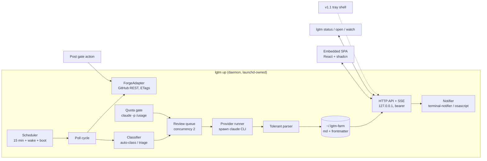

# LGTM v1 design

Status: draft for sign-off
Date: 2026-08-29
Companion to [requirements.md](requirements.md). Task order lives in [tasks.md](tasks.md).

## Architecture

One compiled Bun binary, three roles: a long-lived daemon, short-lived CLI invocations that talk to it over HTTP, and an embedded SPA it serves.



Single-writer rule: only the daemon writes the store. The SPA and the CLI mutate through the API. The daemon also watches the store directory with `fs.watch` so hand-edits show up in the UI without a restart.

## Store layout

```
~/.lgtm-farm/
  token                           # bearer token, created at first run, mode 0600
  daemon.json                     # ephemeral rendezvous: {port, pid, startedAt}, mode 0600,
                                  #   rewritten at boot when the recorded pid is dead
  config.md                       # frontmatter: interval_minutes, pause_above_pct,
                                  #   resume_below_pct, daily_cap, concurrency, and manual
                                  #   binary pins (claude_path, gh_path); a pin skips the probe
  watch.md                        # frontmatter list: {owner, repo, addedAt, lastPolledAt, etag}
  agents/
    reviewer.md                   # frontmatter: provider, timeout_minutes, severity_floor, enabled
                                  # body: the review prompt, appended to the CLI's built-in /review
  templates/
    review-body.md                # post body template with placeholders
  reviews/<owner>/<repo>/pr-<n>/
    meta.md                       # frontmatter below
    diff-<sha>.patch              # diff snapshot per reviewed head SHA, written when a
                                  #   round completes; finding cards slice hunks from
                                  #   their round's own SHA, GitHub link as fallback
    r<N>-<agent>.md               # one file per round per agent, frontmatter below
    r<N>-<agent>.raw.txt          # only when parsing failed
  logs/
    daemon.log                    # rotating, plain text
```

`meta.md` frontmatter:

```yaml
owner: acme
repo: api
number: 42
url: https://github.com/acme/api/pull/42
title: Add rate limiter
author: pszf11235
state: reviewed          # triage | skipped | queued | reviewing | reviewed | failed | closed
classification: own      # own | requested | assigned | mentioned | manual | none
draft: false
headSha: abc123
lastReviewedSha: abc123
failedAttempts: 0        # retry counter per head SHA, reset on new commits
rounds: 2
pendingReviewId: 987654  # set while a draft exists on GitHub; cleared when getReview
                         #   reports it is no longer pending
closedAt: null
updatedAt: 2026-08-29T10:00:00Z
```

`r<N>-<agent>.md` frontmatter holds the canonical findings array; the markdown body is a generated human-readable rendering of the same data:

```yaml
round: 2
agent: reviewer
provider: claude-cli
status: ok               # ok | failed. A failed round still writes this file, with an
                         #   empty findings array, next to its .raw.txt, and round
                         #   numbers stay monotonic across failures
headSha: abc123
startedAt: ...
durationMs: 84210
findings:
  - id: f1
    severity: high        # after applying the agent's severity floor
    file: src/limiter.ts
    line: 118
    comment: "..."
    suggestion: "..."     # optional
    state: open           # open | discarded | posted | held
    heldReason: null      # set when state is held
```

Finding identity everywhere is `r<N>:<agent>:<id>`, printed as `r2:reviewer:f1`, and this is the one canonical form across store, API, and UI. Ids restart at f1 per round file; the old codebase corrupted rounds by matching bare ids, and its fix (key on the full triple) is carried over as a rule, with tests.

Frontmatter is parsed with gray-matter behind a `structuredClone` guard, because gray-matter memoizes and returns shared data objects. This bit the old codebase; the guard and its test port over.

## Poll cycle

Per watched repo, per cycle:

1. `GET /repos/{o}/{r}/pulls?state=open` with the stored ETag. A 304 ends the repo's cycle at zero rate-limit cost.
2. For each open PR, compare against `meta.md`:
   - Unknown PR: classify. Auto-class and not draft: state `queued`. Auto-class draft: state `triage` with a "reviews when ready" marker and the classification recorded. Otherwise: state `triage`.
   - Known PR whose draft flag flipped from true to false: queue it when it is auto-class (or was approved manually) and its head SHA has no completed round. A SHA already reviewed through "review anyway" does not queue again.
   - Known PR, `headSha` unchanged: re-queue when state is `failed` and `failedAttempts` is below 3; otherwise no action.
   - Known PR, new `headSha`: if `reviewed` or `failed` and auto-class or previously approved manually, re-queue for a fresh round with `failedAttempts` reset; if `skipped`, stay skipped; if `triage`, refresh metadata.
   - PR no longer open: state `closed`, `closedAt` stamped, hidden from active views. On reopen, a previously `skipped` PR stays skipped; anything else resumes as a known PR under the rules above, keeping its rounds, findings, and any `pendingReviewId`.
   - PR with a recorded `pendingReviewId`: check it via `getReview`; when the review is no longer pending (submitted in GitHub's UI, or deleted), clear the field so the next post is not refused.
3. Drain the review queue through the quota gate and the concurrency cap. The queue holds at most one entry per PR, and a newer head SHA replaces a queued entry. An in-flight round is never cancelled; it completes, records the SHA it reviewed, and the PR re-queues for the newer SHA. One PR never has two rounds running at once.

At boot, and whenever `daemon.json` names a dead pid, the daemon rewrites `daemon.json` and resets any meta stuck in `queued` or `reviewing` back to `queued`, so a crash never strands a PR.

Classification reads the PR list item: `user.login` (own), `requested_reviewers` (requested), `assignees` (assigned), `@login` in title or body (mentioned). The authenticated login comes from `GET /user`, fetched once and cached.

Triage metadata (additions, deletions, changed files, mergeable state) needs the per-PR detail endpoint, so the daemon fetches it only for PRs entering triage or the backfill list, not on every cycle. CI status is one `GET /commits/{sha}/check-runs` per triage PR; this reads the Checks API only, so CI reporting through the legacy commit Status API renders as "no checks" in v1. GitHub computes `mergeable` asynchronously; a null value renders as "computing", not as a failure.

Scheduler: one cycle at daemon start, then a 15-minute timer with small jitter. Timers do not fire during sleep, so the daemon subscribes to wake notifications and runs a catch-up cycle on wake. An in-flight guard prevents overlapping cycles (a real bug in the old watcher).

## Review execution

The daemon spawns the provider CLI directly. The old codebase's self-invoking `internal-worker` process layer existed to isolate multiple agents; with one agent whose CLI is already a subprocess, v1 drops that layer.

One inherited assumption needs proof before anything builds on it. The old code always spawned the CLI inside a local checkout, while v1 has no clones, so the M0 spike runs the bundled review command against a full PR URL from a neutral working directory on the pinned CLI version (2.1.233 or later; earlier versions break bundled slash commands in print mode) and confirms the findings survive the parser.

When a round completes, the daemon fetches the PR diff at the reviewed SHA and stores it as `diff-<sha>.patch` in the PR dir, the source for hunk slicing on finding cards.

The spawn pattern ports from the old `providers.ts` unchanged in spirit: drain stdout and stderr incrementally, race the timeout against the read, SIGKILL on deadline, salvage partial stdout. Grandchild processes inherit the stdout pipe and can hold it open past the child's death; the race is what makes the timeout real.

Prompt assembly:

```
/review <prUrl>

Additional instructions:
<body of agents/reviewer.md>

<if prior rounds exist>
Already raised in earlier reviews. Verify silently; do not repeat:
- src/limiter.ts:118 [high] <comment>   (r1:reviewer:f3)
...

Respond with JSON only: {"findings":[{"file","line","severity","comment","suggestion"}]}
```

Output goes through the ported `extractFindings` chain (bare JSON, wrapped keys, fenced blocks, CLI envelope unwrap, embedded-JSON scan, prose regex) and `validateFindings` (key and severity aliases, path prefix stripping, severity floor, drop counting). Unparseable output lands in `r<N>-<agent>.raw.txt` and the round records `state: failed`; the PR stays un-reviewed so the next cycle retries.

## Quota gate

Source of truth: `claude -p "/usage"`, spawned with the resolved absolute path. Verified behavior: non-interactive, no tokens or turns consumed, roughly 4 seconds, output like:

```
Current session: 61% used · resets Aug 29 at 3:40pm (Europe/Paris)
Current week (all models): 56% used · resets Aug 29 at 8pm (Europe/Paris)
```

The parser regexes `(\d+)% used` per line and takes the maximum across all reported windows. It also extracts each line's reset time where it can (day, clock time, timezone name; the string carries no year, so the next matching occurrence applies). Percentages are the contract; reset times are best-effort, and when only the percentages parse the gate runs percentage-only and leaves `throttled` through hysteresis alone. The format is not documented, so the parser fails closed into fallback mode rather than misreading.

State machine:

- `ok`: max window below `resume_below_pct`, dispatch freely.
- `throttled` entered when max window exceeds `pause_above_pct` (default 70); no new dispatches, queue holds. The pause notification fires once per throttled entry, deduped by the parsed reset timestamp when available and by the entry transition otherwise.
- Exit `throttled` when max window drops below `resume_below_pct` (default 60) or a parsed reset time passes.
- `fallback` entered when the usage output fails to parse twice in a row. The gate becomes a daily run counter against `daily_cap` (default 20). Every dispatch decision logs its mode.

Probe cadence: before each dispatch if the cached reading is older than 3 minutes, plus a background refresh every 5 minutes while the queue is non-empty.

## ForgeAdapter

The only module allowed to speak to a code host. GitHub is the sole v1 implementation; the interface is the future GitLab seam.

```ts
interface ForgeAdapter {
  listOpenPRs(repo: RepoRef): Promise<PRSummary[] | NotModified>;
  getPR(ref: PRRef): Promise<PRDetail>;            // triage metadata
  getDiff(ref: PRRef): Promise<string>;            // unified diff, current head
  getCheckStatus(ref: PRRef, sha: string): Promise<CheckStatus>;
  createDraftReview(ref: PRRef, review: DraftReview): Promise<{ id: number }>;
  deleteDraftReview(ref: PRRef, id: number): Promise<void>;
  getReview(ref: PRRef, id: number): Promise<"pending" | "submitted" | "gone">;
  authenticatedUser(): Promise<string>;
}
```

Deliberate absences, enforced by tests as in the old codebase: no function submits, publishes, or sends an `event` field. `createDraftReview` builds its request from a function whose test asserts `"event" in body === false`, throws unless the response state is `PENDING`, and refuses an empty comment list.

Posting flow (`POST /api/prs/:ref/post`):

1. If `pendingReviewId` is set, check it via `getReview`. No longer pending: clear the field and continue. Still pending: refuse, unless the recreate flag is passed. Recreate deletes the old draft (`DELETE`, 404 tolerated), clears the field, and flips that draft's `posted` findings back to `open`, since their comments left GitHub with the draft.
2. Re-fetch the current diff. Build `Map<file, Set<rhsLine>>` of added and context lines with the ported diff parser.
3. Validate every `open` and `held` finding. A finding that validates is included, so a held one returns to play automatically. A miss becomes or stays `held` with a reason, disclosed in the body and retried at the next post.
4. When zero findings validate, abort before any GitHub call and return the per-finding held reasons. No body-only review is created.
5. Render `templates/review-body.md` (placeholders: counts by severity, agent list, held list), apply any inline edits from the confirm pane.
6. One `POST .../reviews` with no event key. Assert `PENDING`. Record `pendingReviewId`, mark the included findings `posted`.
7. Dry-run performs steps 2 to 5 and returns the exact request body, writing nothing anywhere.

Token resolution: `GITHUB_TOKEN`, `GH_TOKEN`, `gh auth token` (spawned by absolute path, stderr discarded), then `~/.lgtm-farm/credentials.json` (0600). Re-resolved on any 401, not cached for the daemon's lifetime.

## HTTP API

Bun.serve, bound explicitly to 127.0.0.1, default port 4747, scan to 4757 on conflict after probing `/api/health` for an LGTM signature to distinguish a stale daemon from a foreign process.

| Route | Method | Purpose |
|---|---|---|
| `/` | GET | SPA shell (embedded), unauthenticated |
| `/api/health` | GET | `{app:"lgtm", version, pid}`, unauthenticated |
| `/api/status` | GET | The tray contract: daemon uptime, last cycle time and outcome per repo, queue length, quota state and mode, provider and token detection, counts awaiting gate and triage |
| `/api/events` | GET | SSE stream; accepts `?token=` since EventSource cannot set headers |
| `/api/prs` | GET | PR list with state, classification, triage metadata; filters by state |
| `/api/prs/:owner/:repo/:number/decision` | POST | `{action: "review" \| "skip" \| "unskip" \| "review-anyway"}` |
| `/api/prs/:owner/:repo/:number/findings` | GET | Rounds and findings, hunks sliced from the stored `diff-<sha>.patch` of each finding's round, GitHub link as fallback when the snapshot is missing |
| `/api/prs/:owner/:repo/:number/findings/:key` | PATCH | `{state: "discarded" \| "open"}`, key in the canonical `r2:reviewer:f1` form |
| `/api/prs/:owner/:repo/:number/validate` | POST | Dry-run line validation, per-finding verdicts |
| `/api/prs/:owner/:repo/:number/post` | POST | `{body?, recreate?, dryRun?}`, returns per-finding results |
| `/api/watchlist` | GET/POST/DELETE | Manage watched repos. POST writes triage-state meta entries for every open PR before the repo joins the polled set (so nothing auto-queues ahead of the backfill confirm), then returns the backfill list with metadata and pre-selection; the confirm pane issues one decision call per selected PR. DELETE hides the repo's PRs from active views and keeps the on-disk tree |
| `/api/config` | GET/PATCH | Read and update config.md fields |

Auth: every `/api/*` route except `/api/health` requires `Authorization: Bearer <token>` (or the SSE query token). The token is a random 32 bytes generated at first run and stored in its own `token` file (0600), so it survives daemon restarts; `daemon.json` carries only port, pid, and start time. `lgtm open` launches `http://127.0.0.1:<port>/#t=<token>`; the SPA moves it to localStorage and strips the fragment with `history.replaceState`. A request with a bad token gets a page-level "run lgtm open to reauthenticate" response, not a bare 401. Host header must be `127.0.0.1:<port>` or `localhost:<port>` (kills DNS rebinding); mutating routes also require a matching Origin. No CORS headers are set.

SSE events: `cycle-finished`, `pr-changed`, `findings-ready`, `quota-changed`, `error`. The SPA treats every event as an invalidation hint and refetches; events carry ids, not payloads, so the API stays the single source of truth.

## Web UI

Stack: React 19, shadcn/ui (new-york), Tailwind v4. Scaffolded from `bun init --react=shadcn`, which wires `components.json`, Radix, the Tailwind plugin, and `@/*` paths. Components come from `bunx shadcn add`; custom code is layout and the finding card.

Views:

- **Inbox**: triage PRs (skip / review buttons, metadata line), PRs with ungated findings (finding count by severity, jump to detail), and a collapsed skipped section with unskip buttons. The empty state doubles as a health check showing watcher liveness and next poll time.
- **PR detail**: header (title, author, classification badge, head SHA, GitHub link), finding cards grouped by file. Card: severity chip, `file:line`, comment, suggestion block, sliced diff hunk (about 10 lines, server-rendered from the ported diff parser), discard button, GitHub deep link. Footer: "Post draft (n findings)" opening the confirm pane (editable body, held-back list), then per-finding results and "Open pending review on GitHub".
- **Repos**: watch list with last-poll time, add field (`owner/repo`), remove. Adding opens the backfill pane: open PRs with metadata, auto-class rows pre-checked, one confirm.
- **Settings**: provider and gh detection with resolved paths and manual pins, token status, quota thresholds, interval, daemon info.

Keyboard: `j`/`k` between cards, `d` discard, `enter` confirm. Nothing else in v1.

## Notifications

A small notifier module in the daemon, called by the event bus with dedup rules from R8 (once per distinct error cause; one 4-hour reminder for ungated findings; everything else once).

Transport probe order: `terminal-notifier` (resolved like other binaries; supports `-open` deep links into the UI) then `osascript display notification` (no click action) then silence with a log line. The notifier is fire-and-forget; failures never affect the pipeline.

## Daemon lifecycle

- `lgtm up`: foreground daemon. Writes `daemon.json` on bind, removes it on clean exit, and overwrites it at boot when the recorded pid is dead.
- `lgtm install`: writes `~/Library/LaunchAgents/com.lgtm.daemon.plist` (`KeepAlive`, recognizable label since macOS surfaces it in Login Items) and runs `launchctl bootstrap gui/$UID` plus `kickstart`. No sudo. `lgtm uninstall` runs `bootout` and removes the plist.
- Binary path resolution at boot: run `$SHELL -l -c 'command -v claude gh terminal-notifier'`, keep the resolved absolute paths in memory, re-probe on ENOENT at spawn time, and surface all results in `/api/status`. Manual pins in `config.md` (`claude_path`, `gh_path`) skip the probe for that binary, so a re-probe can never overwrite a deliberate choice.
- Wake handling: subscribe to sleep/wake (via polling of a monotonic-vs-wall clock delta, or an IOKit notification if trivial to wire up); on wake, run a catch-up cycle.
- Store lock: `daemon.json` holds the pid; a second `lgtm up` refuses to start if the pid is alive.

## Build and distribution

- Bun >= 1.3.13 required. The CSS `@layer` bug that mangles Tailwind v4 output was a 1.3.0 regression fixed in 1.3.13 (April 2026), so a plain 1.3.x floor would admit exactly the broken versions; this machine's 1.2.18 must be upgraded.
- Dev loop: `bun --hot src/main.ts`, Bun.serve with `routes` and the HTML import; Tailwind via `bun-plugin-tailwind` configured in `bunfig.toml` `[serve.static]`.
- Production: `bun run build.ts`, which calls the `Bun.build()` JS API with `compile: { outfile: "dist/lgtm" }` and the Tailwind plugin. Never the `bun build --compile` CLI. It ignores bundler plugins and produces an unstyled binary (open Bun bug).
- Distribution v1: a GitHub release with the darwin-arm64 binary and a checksum. Plain binaries downloaded via curl carry no Gatekeeper burden. No brew tap, no signing, until after the dogfood period.

## Ported modules

| Old (main branch) | New home | Tests carried |
|---|---|---|
| `packages/plugins/review/src/domain/diff-parser.ts` | `src/core/diff.ts` (+ hunk slicing for cards) | 28 |
| `packages/plugins/review/src/domain/providers.ts` (claude spawn, run pattern, extractFindings, validateFindings) | `src/provider/` | subset of 42 |
| `packages/plugins/review/src/domain/pending-review.ts` minus submit | `src/forge/github/draft-review.ts` | 30 minus submit tests |
| `packages/plugins/review/src/infra/github.ts` | `src/forge/github/adapter.ts` | 13 |
| `packages/plugins/review/src/domain/review-store.ts` | `src/store/reviews.ts` (new layout, same finding-key rules) | 44, adapted |
| `packages/plugins/review/src/domain/watch-cycle.ts` (`decidePR`) | `src/core/classify.ts` (extended for triage) | 18, adapted |
| `packages/plugins/review/src/domain/pr-ref.ts` | `src/core/pr-ref.ts` | 19 |
| `packages/core/src/store/okf.ts` (gray-matter + clone guard) | `src/store/okf.ts` | 8 |

Everything else in the old tree is reference material, not a porting target.

## Testing

- Ported domain tests come with their modules and must pass before any new feature lands on top.
- The no-publish invariant keeps its explicit tests: request builder emits no `event` key; the GitHub adapter exposes no submitting function.
- The offline harness from the old TESTING.md ports over. A fake `claude` shim on PATH lets the full watch, review, gate, and dry-run-post loop run without network or quota.
- The old removals audit and the final pre-submission review together yield a seven-item regression checklist; each item gets a test in the module it belongs to: a watch add through the API lands in `watch.md` and is polled on the next cycle, the interval default matches its documentation, missing binaries print nothing to stderr during detection, PR listing respects pagination, dry-run writes nothing, cache keys are repo-qualified, an all-failed round does not mark the PR reviewed.

## Deferred decisions

Recorded so they are not re-litigated silently:

- Comment-mention detection (tier b) and the notifications API: revisit if real mentions get missed.
- Cross-agent dedup: only when a second agent exists.
- Repo picker backed by the GitHub API: v1 stays manual `owner/repo` entry.
- Local usage estimation (ccusage-style) as a richer quota fallback: v1's fallback is the daily cap alone.
- Legacy commit Status API as a CI-display supplement: v1 reads the Checks API only.
- Webhook relay delivery: only if a team setup ever needs sub-minute latency.
- Linux support: the daemon is portable; `install` needs a systemd variant.
